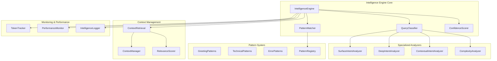
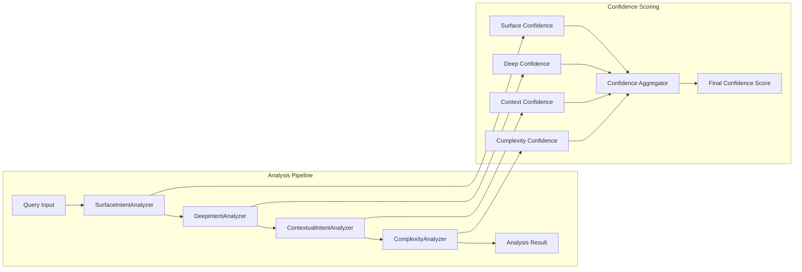
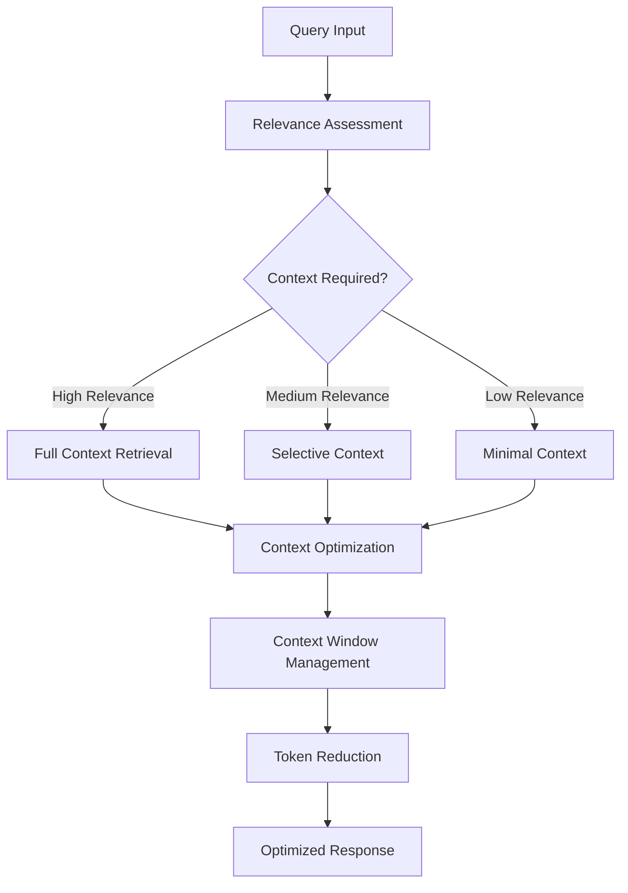
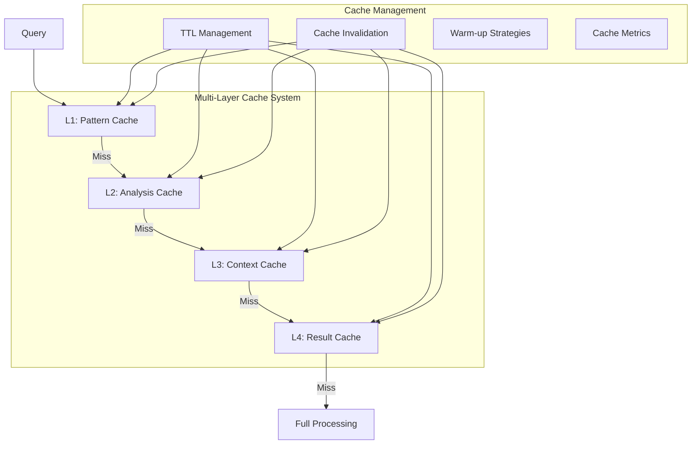
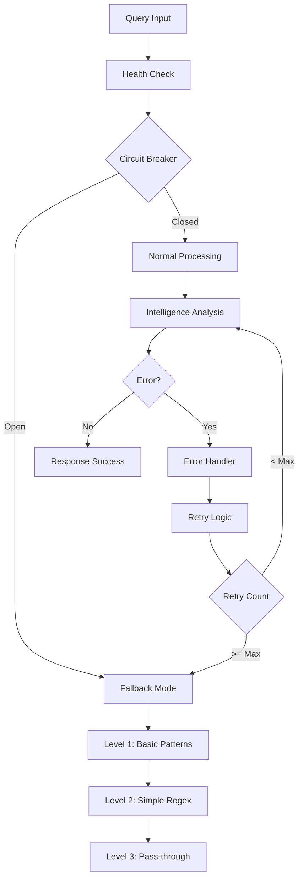
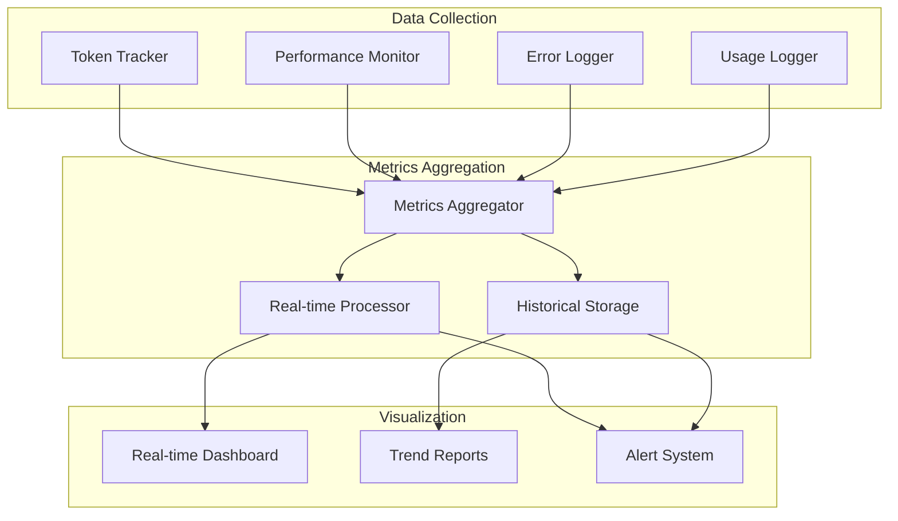
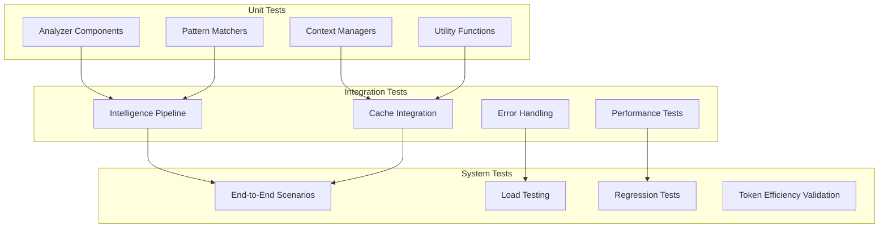
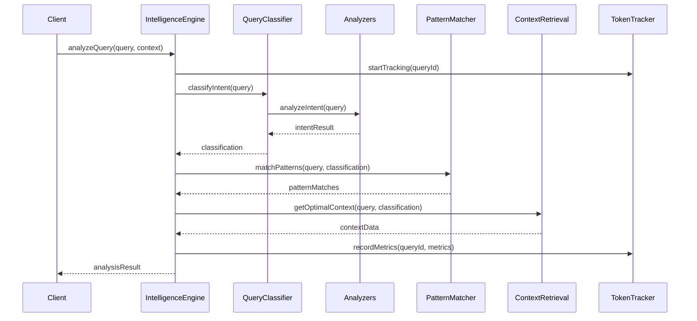
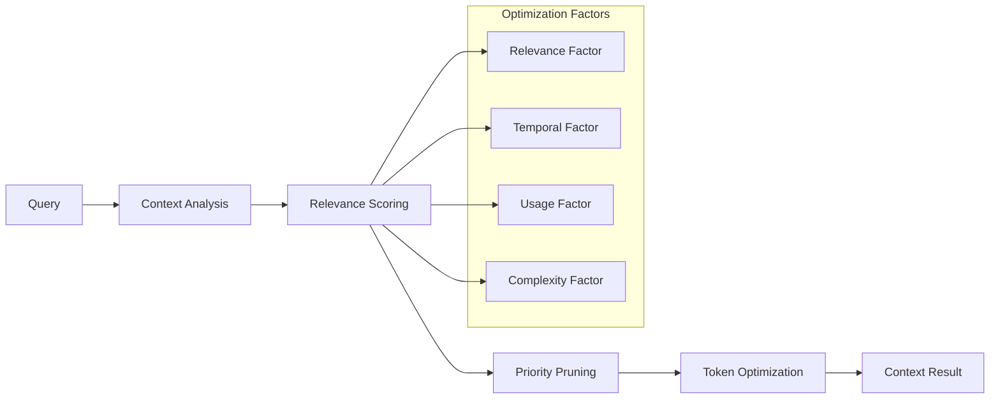
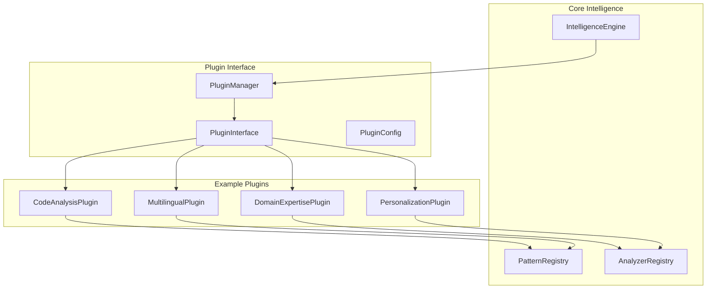

# STEVIE Intelligence System Architecture Refactoring Design

## Overview

This design transforms STEVIE's Intelligence system from a monolithic proof-of-concept to a production-grade, modular architecture while maintaining the critical 97% token efficiency achievement. The refactoring addresses current architectural debt in the intelligence stack and establishes a foundation for scalable, maintainable, and extensible intelligence capabilities.

### Current State Analysis
- **Functional but monolithic**: Single large files with mixed concerns
- **Hard to test**: Tightly coupled components make unit testing difficult
- **Difficult to extend**: Adding new intelligence patterns requires significant refactoring
- **Performance bottlenecks**: Lack of optimization and caching strategies
- **Limited observability**: Insufficient monitoring and debugging capabilities

### Target Architecture Vision
- **Clean modular design**: Single responsibility components with clear interfaces
- **High performance**: Sub-100ms query analysis with intelligent caching
- **Production observability**: Comprehensive monitoring and metrics
- **Extensible framework**: Plugin architecture for new intelligence patterns
- **Bulletproof reliability**: Graceful degradation and error resilience

## Technology Stack & Dependencies

### Core Technologies
- **TypeScript**: Strict typing with comprehensive interfaces
- **Node.js**: Runtime environment for intelligence processing
- **Jest**: Testing framework for unit and integration tests
- **ESLint**: Code quality and consistency enforcement

### Architecture Patterns
- **Strategy Pattern**: Swappable analysis algorithms
- **Factory Pattern**: Dynamic component creation
- **Observer Pattern**: Event-driven intelligence updates
- **Circuit Breaker**: Fault tolerance and graceful degradation
- **Plugin Architecture**: Extensible intelligence capabilities

## Component Architecture

### Intelligence Core Structure



### Component Definitions

#### IntelligenceEngine (Core Orchestrator)
**Responsibility**: Main coordinator for all intelligence operations
**Key Methods**:
- `analyzeQuery(query: string, context: ChatContext): AnalysisResult`
- `getOptimalContext(query: string): ContextData`
- `trackPerformance(operation: string, metrics: PerformanceData): void`

#### QueryClassifier (Pure Classification Logic)
**Responsibility**: Determines query types and routing decisions
**Key Methods**:
- `classifyIntent(query: string): IntentClassification`
- `determineComplexity(query: string): ComplexityLevel`
- `assessConfidence(classification: IntentClassification): number`

#### PatternMatcher (Pattern Recognition Engine)
**Responsibility**: Pattern matching and fallback detection
**Key Methods**:  
- `matchPatterns(query: string): PatternMatch[]`
- `detectFallbackTriggers(query: string): FallbackReason[]`
- `registerPattern(pattern: IntelligencePattern): void`

### Analyzer Architecture



#### SurfaceIntentAnalyzer
**Purpose**: Detects social wrappers and politeness patterns
**Patterns Detected**:
- Greeting patterns (`"hi"`, `"hello"`, `"how are you"`)
- Politeness markers (`"please"`, `"thank you"`, `"could you"`)
- Social conversation indicators

#### DeepIntentAnalyzer  
**Purpose**: Extracts core technical requests beneath social layers
**Capabilities**:
- Code-related request detection
- Technical problem identification
- Implementation requirement extraction
- Architecture discussion recognition

#### ContextualIntentAnalyzer
**Purpose**: Analyzes conversation continuity and context relevance
**Functions**:
- Previous message relationship analysis
- Context window optimization
- Conversation thread tracking
- Topic coherence assessment

#### ComplexityAnalyzer
**Purpose**: Determines when to escalate to full context processing
**Complexity Factors**:
- Technical depth requirements
- Multi-step reasoning needs
- Cross-domain knowledge requirements
- Context dependency levels

## Context Management Architecture

### Context Retrieval Strategy



#### ContextRetrieval Component
**Smart Context Selection Algorithms**:
- Relevance scoring based on query analysis
- Dynamic context window sizing
- Token efficiency optimization
- Context freshness assessment

#### ContextManager Component  
**Context Window Management**:
- Token limit enforcement
- Context priority ranking
- Memory-efficient data structures
- Context expiration handling

#### RelevanceScorer Component
**Context Relevance Calculation**:
- Semantic similarity scoring
- Temporal relevance weighting
- Topic coherence measurement
- Usage pattern analysis

## Performance Optimization Strategy

### Caching Architecture



### Performance Targets
- **Query Analysis**: < 50ms for simple queries, < 100ms for complex
- **Pattern Matching**: < 10ms for fallback detection  
- **Context Retrieval**: < 100ms for relevant context selection
- **Memory Usage**: < 50MB for intelligence system
- **Cache Hit Rate**: > 80% for pattern matching

### Optimization Techniques
- **Lazy Loading**: Analyzers loaded only when needed
- **Pattern Pre-compilation**: Regex patterns compiled at startup
- **Memoization**: Expensive operations cached with intelligent TTL
- **Async Pipeline**: Non-blocking analysis with early returns
- **Memory Pools**: Reusable object instances to reduce GC pressure

## Error Resilience & Fallback System

### Fault Tolerance Architecture



### Fallback Hierarchy
1. **Level 1**: Intelligent analysis with full feature set
2. **Level 2**: Basic pattern matching with reduced features
3. **Level 3**: Simple regex classification
4. **Level 4**: Pass-through to full context (original behavior)

### Error Recovery Mechanisms
- **Circuit Breaker Pattern**: Prevents cascade failures
- **Retry Logic**: Automatic recovery with exponential backoff
- **Health Monitoring**: Component status tracking
- **Graceful Degradation**: Reduced functionality rather than failure
- **Error Aggregation**: Intelligent error pattern detection

## Monitoring & Observability

### Metrics Dashboard Architecture



### Key Performance Indicators
- **Query Processing Latency**: p50, p95, p99 percentiles
- **Token Efficiency**: Percentage by query type over time
- **Cache Performance**: Hit rates for all caching layers
- **Intelligence Health**: Overall system health score
- **Pattern Matching**: Confidence distribution analysis
- **Fallback Frequency**: Degradation pattern tracking

### Monitoring Components

#### TokenTracker
**Token Usage Analytics**:
- Real-time token consumption tracking
- Efficiency trend analysis
- Token savings attribution
- Usage pattern identification

#### PerformanceMonitor  
**Performance Metrics Collection**:
- Response time measurement
- Memory usage tracking
- CPU utilization monitoring
- Throughput analysis

#### IntelligenceLogger
**Structured Logging System**:
- Debug information capture
- Error context preservation
- Performance profiling data
- User interaction patterns

## Testing Strategy

### Test Architecture



### Test Coverage Requirements
- **Unit Tests**: 100% coverage for core intelligence logic
- **Integration Tests**: Complete pipeline validation
- **Performance Tests**: Latency and throughput benchmarks
- **Regression Tests**: Token efficiency and accuracy preservation

### Test Data Strategy
- **Comprehensive Query Dataset**: All known pattern variations
- **Edge Cases**: Boundary conditions and error scenarios
- **Performance Scenarios**: Stress testing with realistic loads
- **Regression Scenarios**: Previous bug reproduction tests

## Implementation Roadmap

### Phase 1: Foundation (60-90 minutes)
**Core Architecture Refactoring**
- Create modular directory structure
- Extract QueryClassifier from AdvancedQueryAnalyzer
- Implement IntelligenceEngine orchestrator
- Build PatternMatcher with clean separation
- Add comprehensive error handling

**Success Criteria**:
- All existing functionality preserved
- Token efficiency maintained at 97%
- Clear separation of concerns achieved
- Basic test coverage in place

### Phase 2: Performance (45-60 minutes)
**Optimization & Caching Implementation**  
- Implement lazy loading for analyzer modules
- Add memoization for expensive operations
- Create intelligent caching system with TTL
- Optimize pattern matching algorithms
- Add performance monitoring instrumentation

**Success Criteria**:
- Sub-50ms analysis for simple queries
- Memory usage under 50MB
- Cache hit rate above 80%
- No performance regressions

### Phase 3: Observability (45-60 minutes)
**Monitoring & Debugging Systems**
- Build production-grade monitoring dashboard
- Implement comprehensive metrics collection
- Create intelligent alerting system
- Add performance profiling tools
- Build debugging and diagnostic interfaces

**Success Criteria**:
- Real-time visibility into all operations
- Proactive alerting on performance issues
- Easy debugging of intelligence problems
- Historical trend analysis available

### Phase 4: Extensibility (30-45 minutes)
**Plugin Architecture & Future-Proofing**
- Design and implement plugin interface
- Create extension registration system
- Build A/B testing framework
- Add configuration management
- Create developer documentation

**Success Criteria**:
- Easy addition of new intelligence patterns
- Safe testing of experimental features
- Clear extension development guidelines
- Minimal performance impact

## Data Flow Architecture

### Intelligence Processing Pipeline



### Context Optimization Flow



## Extension Architecture

### Plugin System Design



### Plugin Interface Specification
```typescript
interface IntelligencePlugin {
  name: string;
  version: string;
  analyze(query: string, context: PluginContext): PluginResult;
  getPatterns(): Pattern[];
  getConfidence(result: PluginResult): number;
  initialize(config: PluginConfig): Promise<void>;
  cleanup(): Promise<void>;
}
```

### Extension Examples
- **CodeAnalysisPlugin**: Specialized code understanding and suggestions
- **DomainExpertisePlugin**: Field-specific intelligence (medical, legal, financial)
- **PersonalizationPlugin**: User-adapted responses based on interaction history
- **MultilingualPlugin**: Non-English language support and translation

## Quality Assurance Framework

### Code Quality Standards
- **TypeScript Strict Mode**: No 'any' types, comprehensive interfaces
- **ESLint Configuration**: Zero warnings policy with custom rules
- **Architecture Patterns**: Single responsibility, dependency injection
- **Documentation**: JSDoc comments for all public APIs
- **Performance Budgets**: Enforced latency and memory limits

### Validation Checklist
- [ ] All existing functionality preserved
- [ ] Token efficiency maintained at 97%
- [ ] Sub-50ms query analysis performance
- [ ] Memory usage under 50MB
- [ ] Cache hit rate above 80%
- [ ] 100% test coverage for core logic
- [ ] Zero TypeScript strict mode errors
- [ ] All monitoring dashboards functional
- [ ] Plugin system accepts extensions
- [ ] Documentation complete and accurate

## Risk Mitigation

### Technical Risks
- **Performance Regression**: Comprehensive benchmarking and performance budgets
- **Token Efficiency Loss**: Continuous monitoring and automated alerts
- **Complexity Introduction**: Strict architectural boundaries and reviews
- **Integration Issues**: Incremental rollout with feature flags

### Operational Risks  
- **Deployment Disruption**: Blue-green deployment with rollback capability
- **Data Loss**: Comprehensive backup and recovery procedures
- **Monitoring Gaps**: Redundant monitoring systems and health checks
- **Team Knowledge**: Extensive documentation and knowledge transfer

This design provides a comprehensive blueprint for transforming STEVIE's Intelligence system into a production-grade, scalable, and maintainable architecture while preserving the critical 97% token efficiency achievement and maintaining alignment with the workspace's Philosophy DNA framework.


