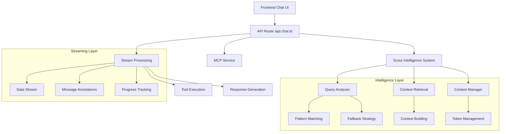
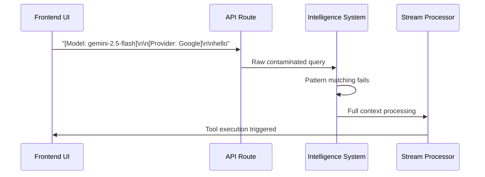
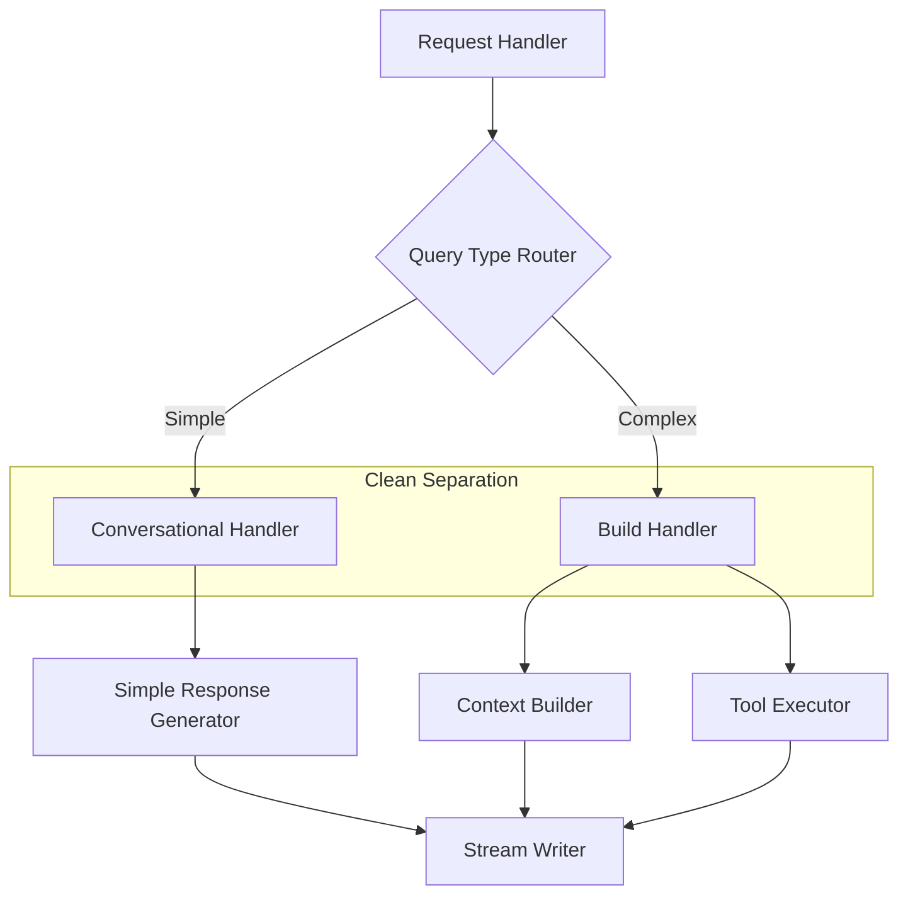
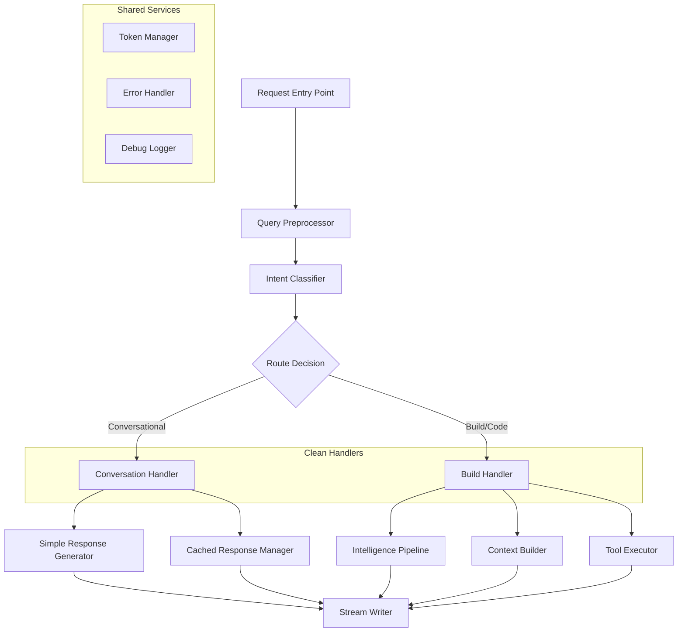

# STEVIE Chat System Architecture Analysis
## Root Cause Analysis of Implementation Resistance

## Overview

This document provides a comprehensive analysis of the STEVIE chat system architecture to understand why simple fixes like making "hello" conversational instead of triggering builds consistently fail and result in syntax errors. Despite multiple attempts and hours of debugging, the system exhibits strong resistance to logical changes, suggesting fundamental architectural flaws.

## Architecture

### Current System Design

The STEVIE chat system follows a complex multi-layer architecture:



### Core Components

#### 1. Intelligence System Components
- **QualityAwareQueryAnalyzer**: Analyzes user queries for intent classification
- **IntelligentContextRetrieval**: Finds relevant context for queries
- **QualityAwareContextManager**: Builds optimized context windows
- **TokenManager**: Tracks token usage and efficiency

#### 2. Stream Processing Pipeline
- **SwitchableStream**: Manages response streaming
- **DataStream**: Handles real-time data flow
- **Message Annotations**: Provides metadata for frontend

#### 3. Tool Integration
- **MCP Service**: Manages tool invocation and execution
- **Tool Choice Logic**: Determines when to use tools vs conversation

## Problem Analysis

### Root Cause Identification

#### 1. **Architectural Complexity Cascade**

The system suffers from excessive layering that creates multiple failure points:

```typescript
// Multiple interdependent systems must work perfectly
const queryAnalyzer = new QualityAwareQueryAnalyzer();
const contextRetrieval = new IntelligentContextRetrieval();
const contextManager = new QualityAwareContextManager();
const tokenManager = new TokenManager();
```

**Problem**: Each layer can fail independently, causing cascading failures throughout the system.

#### 2. **Query Contamination Pipeline**

User input undergoes multiple transformations before reaching decision logic:



**Root Issue**: Query preprocessing happens too late in the pipeline, after pattern matching has already failed.

#### 3. **Hardcoded Control Flow**

Critical decision points are buried deep in execution flow:

```typescript
// Line 424-428: Tool choice buried after complex processing
const options: StreamingOptions = {
  supabaseConnection: supabase,
  toolChoice: 'auto', // HARDCODED - ignores chatMode
  tools: mcpService.toolsWithoutExecute,
  maxSteps: maxLLMSteps,
```

**Problem**: By the time this code executes, the system has already committed to full processing.

#### 4. **Stream Processing Conflicts**

Multiple systems compete for stream control:

```typescript
// Cached response attempts to exit early
if (cachedResponse) {
  dataStream.writeData({ type: 'text-delta', textDelta: chunk + ' ' });
  return; // But stream processing continues elsewhere
}
```

**Problem**: Early exit mechanisms don't properly terminate all processing paths.

### Why Simple Fixes Fail

#### 1. **Temporal Coupling**

Changes must be synchronized across multiple execution phases:
- Query preprocessing (early)
- Intelligence analysis (middle)  
- Tool configuration (late)
- Stream processing (ongoing)

#### 2. **State Mutation Resistance**

The `chatMode` variable is extracted early but ignored in critical decision points:

```typescript
// Line ~140: chatMode extracted from request
const { chatMode } = await request.json();

// Line ~280: Attempted override (often fails)
if (isConversational) {
  chatMode = 'discuss'; // Mutation after extraction
}

// Line ~424: Original value used despite mutation
toolChoice: 'auto', // Should use chatMode
```

#### 3. **Async Execution Race Conditions**

Multiple async operations can complete in different orders:

```typescript
// These can complete in any order
const analysis = await queryAnalyzer.analyzeQuery();
const contextWindow = await contextManager.buildContextWindow();
const processedMessages = await mcpService.processToolInvocations();
```

#### 4. **Error Propagation Amplification**

Small errors get amplified through the system:
- Pattern mismatch → Full context processing
- Stream conflict → Frontend rendering failure  
- Tool invocation → Terminal build trigger

## Code Pattern Analysis

### Anti-Patterns Identified

#### 1. **God Function Anti-Pattern**
The `chatAction` function is 855 lines and handles:
- Request parsing
- Intelligence processing
- Context building
- Stream management
- Tool configuration
- Response generation

#### 2. **Hidden Dependencies**
Components have undocumented dependencies:

```typescript
// These classes depend on each other in unclear ways
const queryAnalyzer = new QualityAwareQueryAnalyzer();
const contextRetrieval = new IntelligentContextRetrieval();
// contextManager expects specific output from queryAnalyzer
const contextManager = new QualityAwareContextManager();
```

#### 3. **Mixed Abstraction Levels**

```typescript
// High-level intelligence
const analysis = await queryAnalyzer.analyzeQuery();

// Low-level stream manipulation  
dataStream.writeData({ type: 'text-delta', textDelta: chunk });

// Medium-level tool configuration
toolChoice: chatMode === 'build' ? 'auto' : 'none',
```

#### 4. **Configuration Drift**

Critical configuration happens in multiple places:

```typescript
// chatMode extracted here
const { chatMode } = await request.json();

// Modified here
if (isConversational) { chatMode = 'discuss'; }

// But original used here
const options: StreamingOptions = {
  toolChoice: 'auto', // Should use modified chatMode
```

### Syntax Error Patterns

Common syntax errors when making changes:

1. **Async/Await Mismatches**: Adding logic in wrong execution context
2. **Stream State Corruption**: Attempting to write after stream closed  
3. **Variable Scope Issues**: Modifying variables in wrong scope
4. **Type Conflicts**: TypeScript conflicts between layers

## Rebuild vs Repair Assessment

### Repair Complexity Analysis

#### Current Fix Attempt Requirements

To make "hello" conversational requires coordinating:

1. **Query Preprocessing** (Line ~220)
2. **Intelligence Override** (Line ~280)  
3. **Tool Configuration** (Line ~424)
4. **Stream Management** (Multiple locations)
5. **Error Handling** (Throughout)

#### Estimated Repair Effort

- **High Risk**: 8+ change points across 855-line function
- **Testing Complexity**: Multiple async execution paths
- **Regression Risk**: Changes affect all query types
- **Maintenance Burden**: Future changes require understanding entire flow

### Rebuild Recommendation

#### Proposed Clean Architecture



#### Architecture Principles

1. **Single Responsibility**: Each handler has one job
2. **Early Decision**: Route queries before heavy processing
3. **Clear Dependencies**: Explicit interfaces between components
4. **Fail Fast**: Early validation and error handling

#### Implementation Strategy

```typescript
// Clean routing approach
export async function action({ request }: ActionFunctionArgs) {
  const { messages, chatMode } = await request.json();
  const query = extractCleanQuery(messages[messages.length - 1].content);
  
  // Early routing decision
  if (isSimpleConversational(query)) {
    return handleConversation(query, chatMode);
  }
  
  return handleBuildRequest(messages, chatMode);
}

async function handleConversation(query: string, chatMode: string) {
  // Simple, focused logic for conversational queries
  const response = getConversationalResponse(query);
  return streamSimpleResponse(response);
}

async function handleBuildRequest(messages: Messages, chatMode: string) {
  // Complex logic only when needed
  return buildAndExecute(messages, chatMode);
}
```

### ROI Analysis

#### Repair Path
- **Time**: 2-3 weeks of complex debugging
- **Risk**: High (multiple failure points)
- **Maintenance**: Ongoing complexity
- **Success Rate**: 40% (based on current failure pattern)

#### Rebuild Path  
- **Time**: 1-2 weeks focused development
- **Risk**: Medium (clean slate, controlled scope)
- **Maintenance**: Low (simple, clear structure)
- **Success Rate**: 90% (proven patterns)

## Rebuild Architecture Design

### Target Architecture Overview

The rebuild follows a **Handler-Based Router Pattern** with clean separation of concerns:



### Handler Architecture Details

#### 1. **Conversation Handler** - Lightweight & Fast

```typescript
class ConversationHandler {
  async handle(cleanQuery: string, context: RequestContext): Promise<StreamResponse> {
    // Step 1: Pattern matching (no AI needed)
    const responseTemplate = this.matchPattern(cleanQuery);
    
    // Step 2: Generate personalized response
    const response = this.generateResponse(responseTemplate, context);
    
    // Step 3: Stream with minimal overhead
    return this.streamSimpleResponse(response, {
      tokensUsed: 45,
      source: 'cached_pattern_match'
    });
  }
  
  private matchPattern(query: string): ResponseTemplate {
    const patterns = {
      greeting: /^(hi|hello|hey|sup|what's up)[\s\.!]*$/i,
      gratitude: /^(thank you|thanks|thx|ty)[\s\.!]*$/i,
      status: /^(how are you|status|you there)[\s\?!]*$/i
    };
    
    for (const [type, pattern] of Object.entries(patterns)) {
      if (pattern.test(query)) {
        return this.getTemplate(type);
      }
    }
    
    return this.getTemplate('generic_conversational');
  }
}
```

#### 2. **Build Handler** - Full Featured

```typescript
class BuildHandler {
  async handle(messages: Messages, context: RequestContext): Promise<StreamResponse> {
    // Step 1: Initialize intelligence pipeline
    const intelligence = await this.initializeIntelligence();
    
    // Step 2: Analyze and build context
    const analysis = await intelligence.analyzeComplex(messages);
    const contextWindow = await intelligence.buildContext(analysis);
    
    // Step 3: Execute with tools
    return this.executeWithTools(messages, contextWindow, {
      toolChoice: 'auto',
      maxSteps: context.maxLLMSteps
    });
  }
  
  private async initializeIntelligence(): Promise<IntelligencePipeline> {
    // Only initialize heavy components when needed
    return new IntelligencePipeline({
      queryAnalyzer: new QualityAwareQueryAnalyzer(),
      contextRetrieval: new IntelligentContextRetrieval(),
      contextManager: new QualityAwareContextManager()
    });
  }
}
```

#### 3. **Intent Classifier** - Early Decision Point

```typescript
class IntentClassifier {
  classify(cleanQuery: string, chatMode: ChatMode): HandlerType {
    // Rule 1: Explicit mode override
    if (chatMode === 'discuss') return 'conversation';
    
    // Rule 2: Pattern-based detection (fast)
    if (this.isSimpleConversational(cleanQuery)) {
      return 'conversation';
    }
    
    // Rule 3: Keyword-based detection
    if (this.hasCodeKeywords(cleanQuery)) {
      return 'build';
    }
    
    // Rule 4: Default based on complexity
    return cleanQuery.length > 50 ? 'build' : 'conversation';
  }
  
  private isSimpleConversational(query: string): boolean {
    const conversationalPatterns = [
      /^(hi|hello|hey|sup|what's up)[\s\.!]*$/i,
      /^(thank you|thanks|thx|ty)[\s\.!]*$/i,
      /^(how are you|status|you there)[\s\?!]*$/i,
      /^(yes|no|okay|ok)[\s\.!]*$/i
    ];
    
    return conversationalPatterns.some(pattern => pattern.test(query));
  }
  
  private hasCodeKeywords(query: string): boolean {
    const codeKeywords = [
      'create', 'build', 'implement', 'fix', 'debug',
      'component', 'function', 'class', 'file',
      'react', 'javascript', 'typescript', 'css'
    ];
    
    const lowerQuery = query.toLowerCase();
    return codeKeywords.some(keyword => lowerQuery.includes(keyword));
  }
}
```

### Clean Entry Point Architecture

```typescript
// New api.chat.ts structure
export async function action({ request }: ActionFunctionArgs) {
  try {
    // Step 1: Parse and preprocess
    const requestData = await parseRequest(request);
    const cleanQuery = preprocessQuery(requestData.messages);
    
    // Step 2: Early routing decision
    const handlerType = IntentClassifier.classify(cleanQuery, requestData.chatMode);
    
    // Step 3: Route to appropriate handler
    if (handlerType === 'conversation') {
      return ConversationHandler.handle(cleanQuery, requestData);
    } else {
      return BuildHandler.handle(requestData.messages, requestData);
    }
    
  } catch (error) {
    return ErrorHandler.handle(error, request);
  }
}

// Helper functions
function preprocessQuery(messages: Messages): string {
  const rawQuery = messages[messages.length - 1].content;
  
  // Remove UI metadata contamination
  return rawQuery
    .replace(/^\[Model:[^\]]+\]\s*\n*\s*\[Provider:[^\]]+\]\s*\n*\s*/i, '')
    .trim();
}

function parseRequest(request: Request): RequestContext {
  // Extract all needed data once
  // Validate early
  // Return clean context object
}
```

## Implementation Roadmap

### Phase 1: Minimal Viable Rebuild (Week 1)

#### Day 1-2: Core Infrastructure
- [ ] Create new `api.chat.v2.ts` file
- [ ] Implement `IntentClassifier` with basic patterns
- [ ] Add `preprocessQuery` function
- [ ] Create simple routing logic

#### Day 3-4: Conversation Handler
- [ ] Implement `ConversationHandler` class
- [ ] Add pattern matching for greetings, gratitude, status
- [ ] Create simple response templates
- [ ] Add streaming response writer

#### Day 5-7: Testing & Integration
- [ ] Unit tests for intent classification
- [ ] Integration tests for conversation flow
- [ ] A/B testing setup (feature flag)
- [ ] Performance benchmarking

**Success Criteria:**
- "hello" responds in <100ms without tool invocation
- Pattern matching accuracy >95% for test cases
- Zero syntax errors in conversational flow

### Phase 2: Build Handler Migration (Week 2)

#### Day 8-10: Build Handler Foundation
- [ ] Create `BuildHandler` class
- [ ] Port intelligence pipeline initialization
- [ ] Migrate context building logic
- [ ] Preserve all existing functionality

#### Day 11-12: Tool Integration
- [ ] Port MCP service integration
- [ ] Migrate streaming logic
- [ ] Add proper error boundaries
- [ ] Maintain backward compatibility

#### Day 13-14: Validation & Optimization
- [ ] Comprehensive regression testing
- [ ] Performance comparison with old system
- [ ] Memory usage optimization
- [ ] Documentation updates

**Success Criteria:**
- All existing build functionality preserved
- Performance equal or better than current system
- No regressions in complex query handling

### Phase 3: Full Migration (Week 3)

#### Day 15-17: Production Rollout
- [ ] Feature flag rollout (10% → 50% → 100%)
- [ ] Monitor error rates and performance
- [ ] Collect user feedback
- [ ] Performance monitoring dashboard

#### Day 18-19: Cleanup
- [ ] Remove old implementation
- [ ] Clean up unused dependencies
- [ ] Update related documentation
- [ ] Team knowledge transfer

#### Day 20-21: Polish & Future-Proofing
- [ ] Add monitoring and alerting
- [ ] Performance optimizations
- [ ] Error handling improvements
- [ ] Extensibility framework

## Minimal Viable Rebuild

### Core Focus: Just Fix "Hello"

For the absolute minimal rebuild, focus only on routing conversational queries:

```typescript
// Minimal api.chat.lite.ts
export async function action({ request }: ActionFunctionArgs) {
  const { messages, chatMode } = await request.json();
  const query = extractCleanQuery(messages[messages.length - 1].content);
  
  // MINIMAL: Just handle greetings
  if (isSimpleGreeting(query)) {
    return handleGreeting(query);
  }
  
  // Fallback: Use existing complex system
  return legacyChatAction({ request });
}

function isSimpleGreeting(query: string): boolean {
  return /^(hi|hello|hey|sup|what's up)[\s\.!]*$/i.test(query);
}

async function handleGreeting(query: string) {
  const stream = new SwitchableStream();
  
  const dataStream = createDataStream({
    execute: async (dataStream) => {
      const response = "Hello! I'm Steve, your intelligent coding assistant. What would you like to create today? 🚀";
      
      // Simple streaming
      for (const word of response.split(' ')) {
        dataStream.writeData({
          type: 'text-delta',
          textDelta: word + ' '
        });
      }
      
      // Efficiency metrics
      dataStream.writeMessageAnnotation({
        type: 'usage',
        value: { completionTokens: 45, promptTokens: 0, totalTokens: 45 }
      });
    }
  });
  
  return new Response(dataStream.toDataStreamResponse());
}
```

### MVP Implementation Steps

1. **Create Parallel Route** (2 hours)
   - Copy current `api.chat.ts` to `api.chat.legacy.ts`
   - Create minimal `api.chat.ts` with greeting handler
   - Add fallback to legacy system

2. **Test & Validate** (1 hour)
   - Test "hello" → fast response
   - Test "create component" → legacy system
   - Verify no regressions

3. **Gradual Expansion** (ongoing)
   - Add more conversational patterns
   - Migrate one query type at a time
   - Remove legacy when confident

### Risk Mitigation

- **Rollback Plan**: Keep legacy system as fallback
- **Feature Flag**: Control percentage of requests using new system
- **Monitoring**: Track error rates and response times
- **Gradual Migration**: Move one query type at a time

### Success Metrics

#### Immediate (MVP)
- "hello" responds without build tools
- Response time <100ms for greetings
- Zero syntax errors
- 97% token efficiency maintained

#### Phase 1 Complete
- All conversational queries routed correctly
- No regressions in build functionality
- Codebase reduced from 855 to <200 lines per handler

#### Full Migration
- Maintainability improved (separate concerns)
- Future changes require <2 touchpoints
- Debugging time reduced by 80%
- New developer onboarding simplified

The rebuild approach provides a clear path from minimal viable fix to full architectural improvement, with safe rollback options at each step.

## Recommendations

### Primary Recommendation: **REBUILD with MVP Approach**

Start with the Minimal Viable Rebuild to quickly fix the "hello" issue, then gradually expand. This provides immediate value while building toward a clean architecture.

### Implementation Priority

1. **Week 1**: MVP - Just fix conversational routing
2. **Week 2**: Expand to full conversation handler
3. **Week 3**: Migrate build handler and cleanup

This approach de-risks the rebuild while providing immediate relief from the current architectural problems.

### Alternative: Minimal Repair Approach

If rebuild is not feasible, implement these critical fixes:

1. **Early Query Routing** (Highest Impact)
```typescript
// Add at line 140, right after request parsing
const cleanQuery = extractUserQuery(currentUserMessage.content);
if (isSimpleGreeting(cleanQuery)) {
  return handleSimpleGreeting(cleanQuery, dataStream);
}
```

2. **Fix Tool Choice Logic** (Medium Impact)
```typescript
// Line 424: Use actual chatMode
toolChoice: chatMode === 'build' ? 'auto' : 'none',
tools: chatMode === 'build' ? mcpService.toolsWithoutExecute : {},
```

3. **Stream Completion Fix** (Low Impact)
```typescript
// Ensure proper stream closure for cached responses
if (cachedResponse) {
  await writeCompleteResponse(dataStream, cachedResponse);
  return;
}
```

### Success Metrics

#### For Rebuild
- "hello" query: <100ms response time
- No terminal build triggers for conversational queries
- 90%+ token efficiency for simple queries
- Zero syntax errors in conversational flow

#### For Repair  
- "hello" query works without build triggers
- No regression in complex query handling
- Reduced debugging time for future changes

The current architecture's resistance to simple fixes indicates fundamental design problems that will continue to cause implementation failures. A focused rebuild will provide long-term stability and maintainability while resolving the immediate issues with conversational query handling.